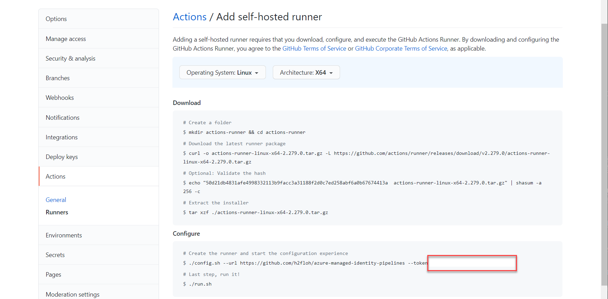
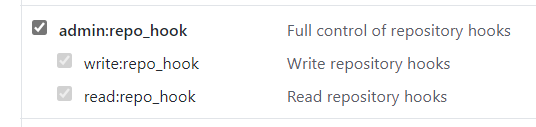

# Azure Managed Identity Pipelines

This repo showcases the possibility to leverage self-hosted build agents in Azure for both `Azure Pipelines` and `GitHub Actions`
without the need to specify Service Connections, VariableGroups, Action Secrets.

Still secrets will be securely managed in Azure KeyVault and are accessible for the self-hosted agent by leveraging MSI (Managed Service Identity).

## Set up your dev environment

First, please fork this repo. You need to do that in order to link the GitHub Action Runner and to link the repo in Azure DevOps.

If you are using VSCode, installed the Remote Container extension and have a Docker runtime installed you are ready to go with the provided devcontainer.

Otherwise you will need to install

- [Azure CLI](https://docs.microsoft.com/en-us/cli/azure/install-azure-cli)
- [Bicep for Azure CLI](https://docs.microsoft.com/en-us/azure/azure-resource-manager/bicep/install)
- [Azure CLI DevOps extension](https://docs.microsoft.com/en-us/azure/devops/cli/?view=azure-devops)

## Set up your infrastructure

You will need access to an Azure Subscription or Resource Group with Owner rights.
If you don't have that yet you can create a free trial account [here](https://azure.microsoft.com/en-us/free/).

1. Clone your fork.
1. Run the following script. Where the settings can be found will be explained in the next sections:

    ```bash
    cd iac
    az deployment sub create -l <azureregion> \
      -f ./main.bicep --parameters username=<username> \
      sshPublicKey="$(cat ~/.ssh/id_rsa.pub)" \
      salt="<somesalt>" \
      AzDOPATtoken='<AzurePATtoken>' \
      AzDOAccountUrl='<AzDOAccountUrl>' \
      AzDOAgentPool='<AzDOAgentPool>' \
      GitHubRepoURL='<GitHubRepoURL>' \
      GitHubToken='<GitHubToken>' \
      --name setup
    ```

1. The script JSON output contains a section `outputs` please record the values for acr_name and kv_name, you will need them later. Will look like this:

    ```json
    "outputs": {
      "acr_name": {
        "type": "String",
        "value": "acr6po7kgbndb7ye"
      },
      "kv_name": {
        "type": "String",
        "value": "kv6po7kgbndb7ye"
      }
    },
    ```

### Parameters for deployment

Please create a new project within your Azure DevOps Organization. You can follow [this guide](https://docs.microsoft.com/en-us/azure/devops/organizations/projects/create-project?view=azure-devops&tabs=preview-page) if you don't have one.

>If you only want to test it for GitHub Actions please leave the AzDO\* parameters defined but blank.
>If you only want to test it for Azure Pipelines leave the GitHub\* parameters defined but blank.

**azureregion:** Select any region you want. You can get a list of all regions available to you with this command `az account list-locations -o table` use the `Name` value.

**username:** Select any user name you like.

**sshPublicKey:** If you don't have a ssh credential yet please create one using [this guide](https://www.cyberciti.biz/faq/how-to-set-up-ssh-keys-on-linux-unix/). The user .ssh folder will be mounted within the devcontainer.

**salt:** Enter anything you want. This string will be used to create a unique string for Azure service names which need to be globally unique (esp. KeyVault and Container Registry).

**AzDOPATtoken:** Go through [these steps](https://docs.microsoft.com/en-us/azure/devops/pipelines/agents/v2-linux?view=azure-devops#authenticate-with-a-personal-access-token-pat) to generate your PAT Token, it will only need the `Agent Pools (read, manage)` scope.

**AzDOAccountUrl:** This will be your AzDO Server URL like described [here](https://docs.microsoft.com/en-us/azure/devops/pipelines/agents/v2-linux?view=azure-devops#server-url).

**AzDOAgentPool:** You can use the `Default` pool named `Default` or create a new one under Agent Pools. See [here](https://docs.microsoft.com/en-us/azure/devops/pipelines/.agents/v2-linux?view=azure-devops#azure-pipelines).

**GitHubRepoURL:** The URL of your fork of this repo e.g. `https://github.com/<yourid>/azure-managed-identity-pipelines`.

**GitHubToken:** The token to add a Runner to your repo. Go to this menu mentioned [here](https://docs.github.com/en/actions/hosting-your-own-runners/adding-self-hosted-runners#adding-a-self-hosted-runner-to-a-repository) and use the token displayed.


### Troubleshooting

If you get following error message while spinning up the environment above, please just re-execute. Sometimes the propagation of objects within AAD takes some time.

>Principal `xyz` does not exist in the directory `abc`.

## Run the GitHub Action Workflows

GitHub Actions require to be within a specific folder of the repo. There is no additional setup needed to use them.

1. Navigate to your forked GitHub repo.
1. Click on Actions.
1. Under all workflows click on 'Build the agent container image'.
1. Select run workflow.
1. Enter the name of your Azure Container Registry.
1. Click on `Run the workflow`.

Wait for the workflow to be completed. Now you can execute the second workflow which showcases
the retrieval of a configuration item from KeyVault.

1. Under all workflows click on 'Retrieve Configuration without providing a secret'.
1. Select run workflow.
1. Enter the name of your Azure Container Registry.
1. Enter the name of your KeyVault.
1. Click on `Run the workflow`.

You should see the value `somevalue` displayed in the `Use Config` step of the workflow under
both Jobs `Read configuration from KeyVault` and `Reuses the config value from previous job`.

The configuration key and value was created within the [IaC script](iac/keyvault.bicep).

## Run the Azure Pipelines

To set up Azure Pipelines we have to do some prep work.

### Preperation of Azure Pipelines

1. Please create a new project within your Azure DevOps Organization. You can follow [this guide](https://docs.microsoft.com/en-us/azure/devops/organizations/projects/create-project?view=azure-devops&tabs=preview-page).
1. Create a GitHub PAT with scope `admin:repo_hook`. You can follow [this guide](https://docs.github.com/en/github/authenticating-to-github/keeping-your-account-and-data-secure/creating-a-personal-access-token).
  
1. Execute the following script with your values for the env variables:

    ```bash
    export AZURE_DEVOPS_EXT_GITHUB_PAT=''
    export YOUR_GIT_HUB_ID=''
    export YOUR_AZURE_DEV_OPS_ORG=''
    export YOUR_AZURE_DEV_OPS_PROJECT_NAME=''

    service_connection_id=$(az devops service-endpoint github create \
    --github-url https://github.com/$YOUR_GIT_HUB_ID/azure-managed-identity-pipelines/ \
    --name github \
    --organization https://dev.azure.com/$YOUR_AZURE_DEV_OPS_ORG \
    --project $YOUR_AZURE_DEV_OPS_PROJECT_NAME \
    -o tsv --query 'id')

    az pipelines create \
    --name 'Create Agent Image' \
    --description 'Builds and Pushes the agent image' \
    --repository https://github.com/$YOUR_GIT_HUB_ID/azure-managed-identity-pipelines/ \
    --branch main \
    --yml-path pipelines/create-agent-image.yml \
    --organization https://dev.azure.com/$YOUR_AZURE_DEV_OPS_ORG \
    --project $YOUR_AZURE_DEV_OPS_PROJECT_NAME \
    --service-connection $service_connection_id

    az pipelines create \
    --name 'Retrieve Configuration without providing a secret' \
    --description 'Retrieve Configuration without providing a secret' \
    --repository https://github.com/$YOUR_GIT_HUB_ID/azure-managed-identity-pipelines/ \
    --branch main \
    --yml-path pipelines/retrieve-settings-from-key-vault.yml \
    --organization https://dev.azure.com/$YOUR_AZURE_DEV_OPS_ORG \
    --project azure-managed-identity-pipelines \
    --service-connection $service_connection_id
    ```

### Execute the pipelines

1. Navigate to your Azure DevOps Project.
1. Click on `Pipelines` in the menu.
1. Click on `All`.
1. Click on `Create Agent Image`.
1. Click on `Run Pipeline`.
1. Leave `Commit` parameter empty
1. Enter the Agent Pool Name you created for the IaC script (eventually you did use `Default`)
1. Enter the name of your Azure Container Registry.
1. Click on `Run`.

Wait for the Pipeline Run to finish. Now you can execute the second pipeline which showcases the retrieval of a configuration item from KeyVault.

1. Click on `Pipelines` in the menu.
1. Click on `All`.
1. Click on `Retrieve Configuration without providing a secret`.
1. Click on `Run Pipeline`.
1. Leave `Commit` parameter empty
1. Enter the Agent Pool Name you created for the IaC script (eventually you did use `Default`)
1. Enter the name of your Azure Container Registry.
1. Enter the name of your KeyVault.
1. Click on `Run`.

You should see the value `somevalue` displayed in the `Use Config` step of the workflow under both Stages/Jobs `Read configuration from KeyVault` and `Reuse config from previous stage`.

The configuration key and value was created within the [IaC script](iac/keyvault.bicep).

## Cleanup

To clean up your resources just delete the resource group:

```bash
az group delete --resource-group self-hosted-agent-rg
```
